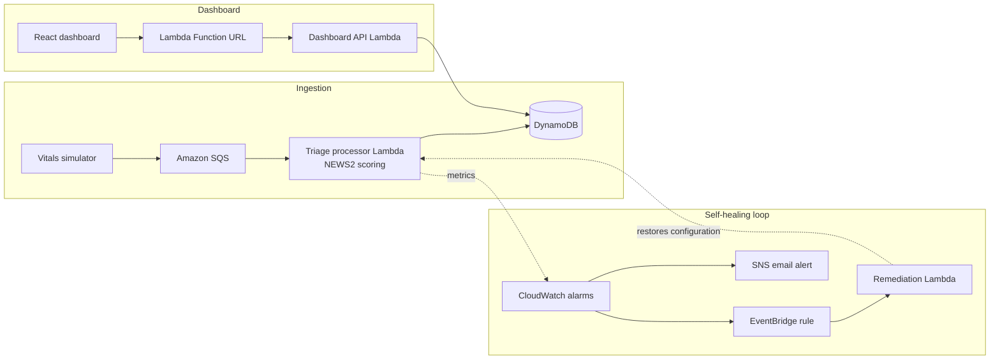

# Aegis: Patient Triage with Self-Healing Infrastructure

A serverless patient-monitoring pipeline on AWS. It scores simulated vital signs with the NEWS2 clinical early-warning standard, shows patients on a live dashboard ordered by risk, and repairs its own infrastructure when an outage is injected.

> All patient data is synthetic, generated by the included simulator. This is an engineering project, not a medical device.


<p>
  
  
  
</p>

## What this demonstrates

- Event-driven serverless design: a queue absorbing bursts, a function scoring each reading, and a table holding state
- Modular Terraform with remote state and locking, so the stack is reproducible and safe for more than one operator
- Observability wired to action: an alarm triggers an event rule that invokes remediation, instead of paging a human
- Chaos engineering: three injected failure modes, automatic recovery, and postmortems with measured recovery times

## Highlights

- **Clinical scoring:** NEWS2 from respiration rate, SpO₂ (including the COPD Scale 2 target range), supplemental oxygen, systolic blood pressure, heart rate, temperature and consciousness, with unit tests on the threshold boundaries
- **Serverless pipeline:** simulator → SQS → Lambda → DynamoDB, provisioned with modular Terraform and a remote S3 state backend with DynamoDB locking
- **Live dashboard:** a React (Vite) app that polls a Lambda Function URL and orders patients by clinical urgency
- **Observability:** CloudWatch dashboard, alarms and SNS email alerts
- **Chaos engineering:** a CLI that injects three failure modes and rolls them back
- **Self-healing:** alarms trigger an EventBridge rule that invokes a remediation Lambda, which restores the broken configuration with no manual step
- **Postmortems:** a generator that writes incident reports with MTTR figures
- **CI/CD:** GitHub Actions runs the tests, Terraform checks and the frontend build, and applies Terraform on pushes to `main`

## Architecture



The full design, including the remediation flow, is in [docs/architecture.md](docs/architecture.md).

## NEWS2 risk levels

| Level | Rule |
|---|---|
| **LOW** | Total score 0–4 and no single parameter scoring 3 |
| **MEDIUM** | Total score 5–6, or any single parameter scoring 3 |
| **HIGH** | Total score 7 or more |

<details>
<summary>Full scoring matrix</summary>

| Parameter | 3 | 2 | 1 | 0 | 1 | 2 | 3 |
| :--- | :---: | :---: | :---: | :---: | :---: | :---: | :---: |
| **Respiration rate** | ≤ 8 | | 9–11 | 12–20 | | 21–24 | ≥ 25 |
| **SpO₂ Scale 1** | ≤ 91 | 92–93 | 94–95 | ≥ 96 | | | |
| **SpO₂ Scale 2** (COPD) | ≤ 83 | 84–85 | 86–87 | 88–92 | 93–94 (O₂) | 95–96 (O₂) | ≥ 97 (O₂) |
| **Supplemental oxygen** | | Yes | | No | | | |
| **Systolic BP** | ≤ 90 | 91–100 | 101–110 | 111–219 | | | ≥ 220 |
| **Heart rate** | ≤ 40 | | 41–50 | 51–90 | 91–110 | 111–130 | ≥ 131 |
| **Temperature (°C)** | ≤ 35.0 | | 35.1–36.0 | 36.1–38.0 | 38.1–39.0 | ≥ 39.1 | |
| **Consciousness** | | | | Alert | | | Confused, voice, pain or unresponsive |

Implemented in `simulator/triage_scoring.py`.

</details>

## Repository structure

```text
simulator/                 Vitals simulator, NEWS2 scoring engine and unit tests
lambdas/                   triage_processor, dashboard_api and remediation handlers
infra/                     Terraform root module with sqs, dynamodb, lambda and observability modules
frontend/                  React + Vite triage dashboard
chaos/                     Outage injection and rollback CLI
postmortem/                Incident report generator and a sample report
docs/                      Architecture documentation
scripts/                   AWS cleanup helper
.github/workflows/ci-cd.yml   CI/CD pipeline
```

## Getting started

### 1. Scoring engine and simulator

```bash
python -m unittest discover -s simulator/tests
python simulator/vitals_simulator.py --patients 5 --interval 2 --duration 30
```

| Option | Default | Meaning |
|---|---|---|
| `--patients` | 5 | Number of simulated patients |
| `--copd-ratio` | 0.2 | Share of patients on the COPD SpO₂ target range |
| `--interval` | 2.0 | Seconds between readings per patient |
| `--duration` | 0 | Seconds to run; `0` runs indefinitely |
| `--output` | | Also write JSON lines to this file |
| `--sqs-queue` | | Stream readings to this SQS queue |

### 2. AWS pipeline

Terraform keeps its state in the S3 bucket `rajgenstack-triage-tfstate` with locking in the DynamoDB table `rajgenstack-triage-tfstate-locks`. Create both, or change the backend configuration, before the first run.

```bash
cd infra
terraform init
terraform apply -var="alert_email=you@example.com"
```

Confirm the SNS subscription email, then stream vitals into the queue:

```bash
python simulator/vitals_simulator.py --patients 5 --interval 2 --duration 30 \
  --sqs-queue rajgenstack-triage-vitals-queue
```

### 3. Dashboard

```bash
cd frontend
npm install
npm run dev        # http://localhost:5173
```

## Chaos engineering and self-healing

```bash
python chaos/outage_simulator.py status
python chaos/outage_simulator.py inject --scenario db-failure
python chaos/outage_simulator.py rollback --scenario db-failure
```

| Scenario | Failure injected | What remediation restores |
|---|---|---|
| `concurrency-block` | Concurrency limit that stops the processor Lambda from running | Removes the limit |
| `event-mapping-disable` | Disables the SQS trigger on the processor | Re-enables the trigger |
| `db-failure` | Points the processor at a DynamoDB table that does not exist | Restores the table name |

When the resulting CloudWatch alarm enters `ALARM`, EventBridge invokes the remediation Lambda, which uses boto3 to put the configuration back.

## Postmortems

```bash
python postmortem/generate_postmortem.py --incident-id INC-001 --scenario db-failure --duration 85
```

This writes `postmortem/incident_INC-001.md` with MTTR metrics. `postmortem/incident_INC-2026-001.md` is an example.

## CI/CD

| Job | What it does |
|---|---|
| Python tests | Runs the simulator unit tests |
| Terraform checks | `terraform fmt` and `terraform validate` |
| Frontend build | `npm run build` |
| Deploy | `terraform apply` on pushes to `main` |

Repository secrets: `AWS_ACCESS_KEY_ID`, `AWS_SECRET_ACCESS_KEY` and `AWS_REGION`.

> Every push to `main` runs `terraform apply -auto-approve` against the configured AWS account.

## License

© 2026 Rajan Kumar. All rights reserved. No part of this repository may be copied or redistributed without written permission from the author.

---

<div align="center">
  <sub>Maintained by <a href="https://github.com/RajGenStack">Rajan Kumar</a> · <a href="https://www.linkedin.com/in/rajan-kumar42">LinkedIn</a></sub>
</div>
