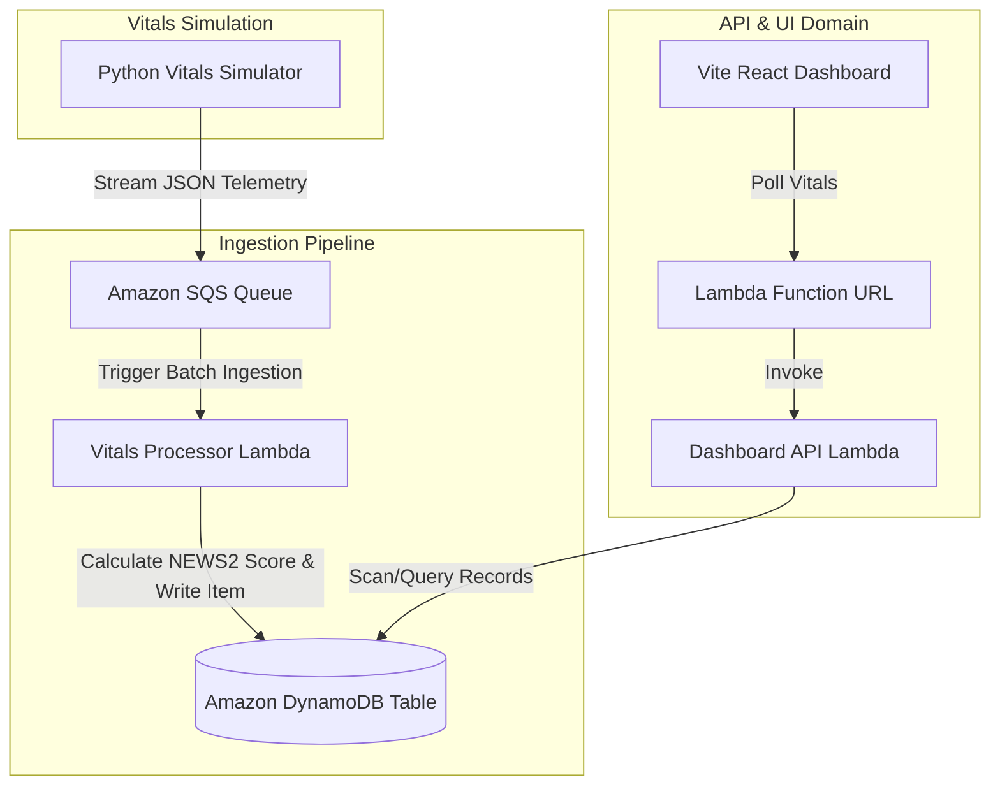
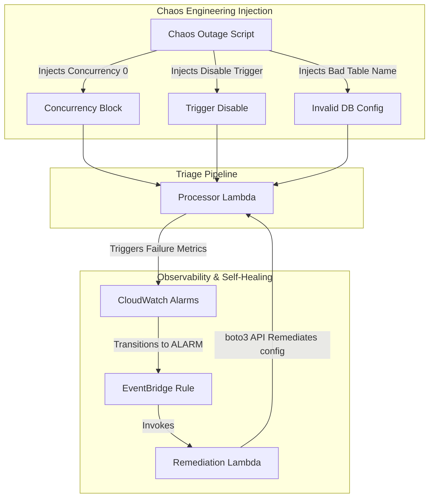

# AEGIS Patient Triage System Architecture

This document describes the end-to-end architecture, pipelines, and self-healing loop for the **AEGIS Smart Patient Triage System**.

---

## 1. System Components

The architecture consists of four core domains:
1. **Core Processing Pipeline**: SQS Message ingestion, Lambda NEWS2 scoring, and DynamoDB storage.
2. **Observability Suite**: CloudWatch dashboard metrics, SNS alerts, and custom alarms.
3. **Closed-Loop Self-Healing**: EventBridge rule monitoring alarm states and triggering automated remediation.
4. **State Storage & Locking Backend**: S3 bucket (`rajgenstack-triage-tfstate`) and DynamoDB lock table (`rajgenstack-triage-tfstate-locks`) for secure remote state tracking.

---

## 2. Ingestion & Query Telemetry Flow

The following diagram illustrates the patient data flow, starting from physiological simulation to database ingestion and dashboard rendering:

- **NEWS2 Scorer**: Calculates early warning clinical risk scores (LOW, MEDIUM, HIGH) based on respiration rate, SpO2 (including COPD scale 2 override), BP, HR, body temperature, and consciousness.
- **Vite React UI**: Displays real-time clinical scores, patient profiles, alarm metrics, and triage lists sorted automatically by early warning severity.

---

## 3. Closed-Loop Self-Healing & Chaos Vector

The observability suite monitors pipeline performance and triggers self-healing loops when chaos outages are injected:

### Self-Healing Scenarios Resolved:
1. **`concurrency-block`**: Replaces the reserved concurrency limit of 0 with unlimited.
2. **`event-mapping-disable`**: Re-enables the disabled SQS trigger mapping.
3. **`db-failure`**: Corrects the `DYNAMODB_TABLE` environment variable back to the valid name.

---

## 4. Infrastructure State Management

To prevent configuration drift, resource conflicts, and state mismatch between local environments and the GitHub Actions CI/CD pipeline, the system utilizes a **Remote Terraform State Backend**:
- **State Storage (S3)**: The S3 bucket `rajgenstack-triage-tfstate` serves as the centralized source of truth for the compiled resource state.
- **State Locking (DynamoDB)**: The table `rajgenstack-triage-tfstate-locks` manages distributed locks using a `LockID` key. This prevents concurrent deployments (e.g. parallel runs of GitHub Actions and local executions) from corrupting the state file.
- **Encryption**: State objects are encrypted at rest via AWS-managed KMS keys.
